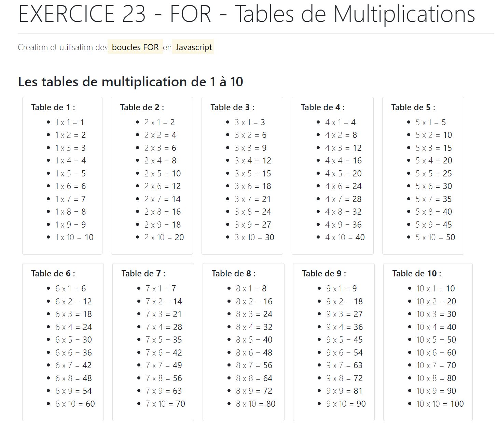

# Exercice 23 – For – Tables de Multiplications

Sujet : Créez un nouveau projet et réalisez le programme permettant :
- Déclarez les variables d’itération permettant de générer les 10 tables de multiplication et réalisez l’instruction permettant leurs affichages.
- Effectuer l’affichage du résultat dans la page HTML comme indiqué dans l’exemple ci-dessous
  
Faire le rendu comme indiqué ci-dessous

---

