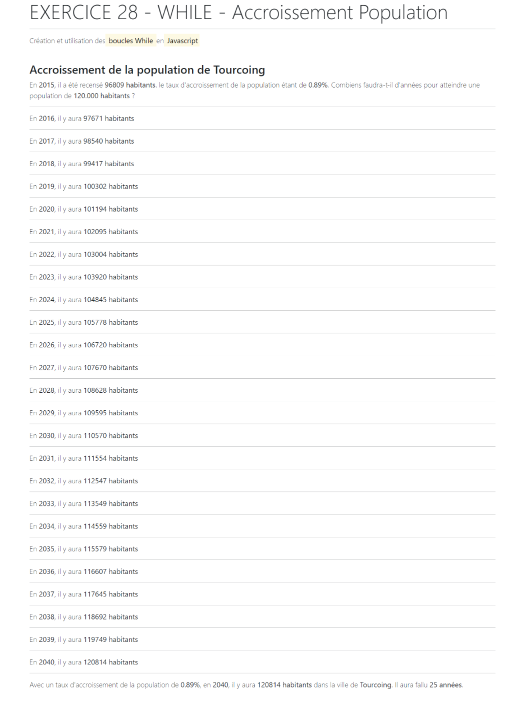

# Exercice 28 – While – Accroissement Population

Sujet : Créez un nouveau projet et réalisez le programme permettant :

- L’accroissement de la population de Tourcoing est de 0,89%
- En 2015, la ville comptait 96809 habitants
- Combien d’années faut-il pour atteindre 120.000 habitants ?
- Combiens y aura-t-il d’habitants cette année-là ?

---

